# Unity Player ID

## Summary

### Overview

The Unity player account system (Player Identity, abbreviated as Player ID) can help developers easily build a secure identity verification system. We support the following login methods for developers to use:

* Anonymous login
* Email password login
* Mobile phone number login
* WeChat login (for the time being, only Android and ios platform logins are supported, and other platforms will be added in future versions)

Developers can use PlayerId services by using PlayerId SDK. PlayerId SDK starts with[package](https://docs.unity3d.com/Packages/com.unity.package-manager-ui@1.8/manual/index.html) Released in the form of, which contains UI resources that can be used directly [user auth prefab](https://docs.unity3d.com/Manual/Prefabs.html)。

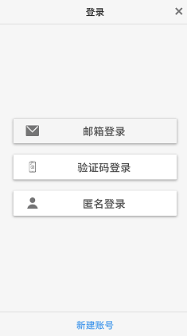


Figure 1 Editor Play Mode example

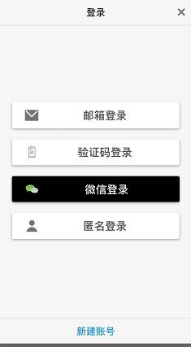

Figure 2 Example of an Android phone (after adding WeChat login)

In this document, we introduce the following:
* PlayerId package settings
* UI modification of PlayerId prefab
* Use of PlayerId prefab

|         |            |
| ------------- |-------------|
| Unity development requirements        | <ul><li>Unity 2019.2.</li><li>Unity Developer account</li></ul>|
| Mobile version requirements        | <ul><li>iOS version 13+</li><li>Android version 6+</li></ul>|


**Note**: If you want to use other authentication servers, please refer to [Extensions](#Extensions).


## Download PlayerId SDK

PlayerId SDK requires Unity 2019.2 and above. Developers can download the PlayerId SDK through Unity's Package Manger Window.
* Open Package Manger Window through **Window ► Package Manger**
* Check **Advanced ► Show preview packages**
* Search for package and install, the keyword is Player Identity (CN).

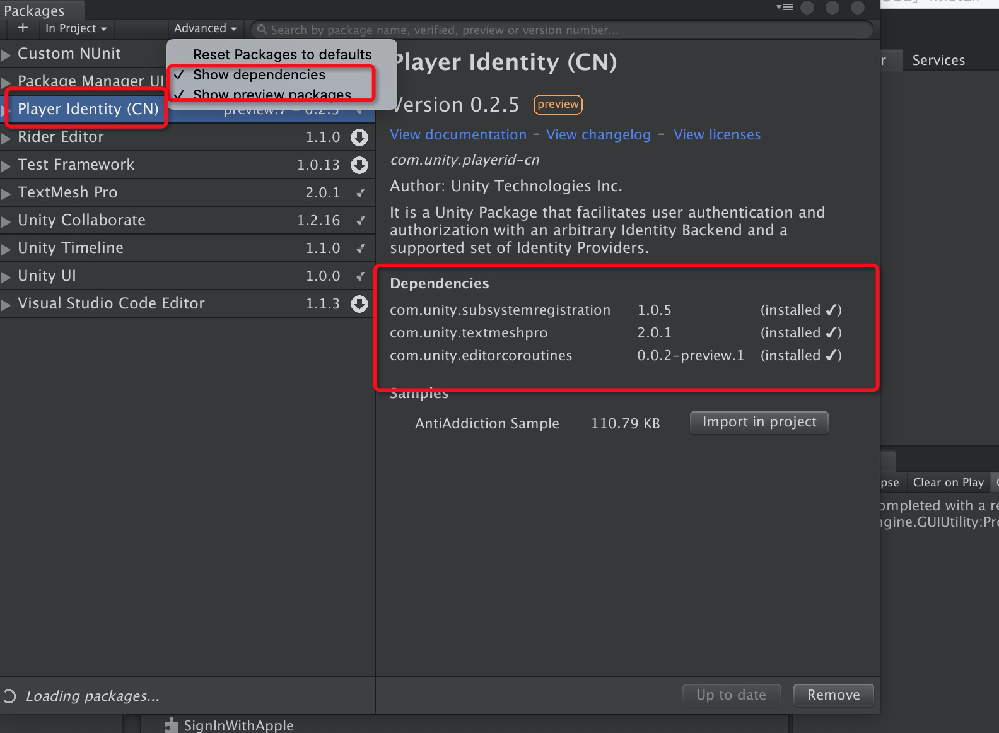


After installing and importing, you can see the Player Identity package in the Packages directory of the project.

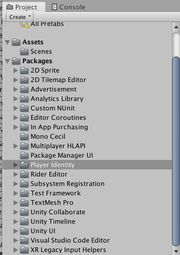

**Note**: PlayerId(CN) is currently only released in China. If it is a foreign IP, the package cannot be searched in Package Manager.


## Login option settings

Developers first need to set the login options for PlayerId in Unity.
1. **Start the Unity editor**

	The version number is 2019.2.x and above, you can create a new project or use an existing project.

1. **Initial setup**
	open Edit ► Project Settings, open**Player Identity ► Backends ► Unity User Auth**。
	
	**Connected to Unity Cloud Service**

	If you create a new project, the following error page pops up. Please follow the prompts to connect to Unity Cloud Service. 
	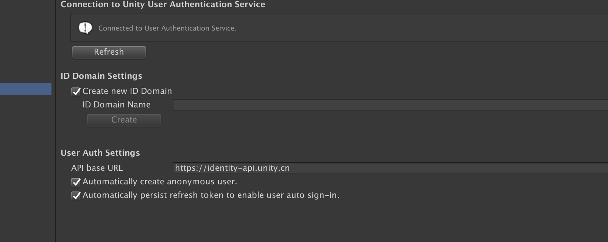

	Click the Open Services button. Create according to the prompts on the web page Unity Cloud Services ID。

	**Project settings**
	
	Set it on the Unity UserAuth page. ( **Player Identity ► Backends ► Unity User Auth**). 
	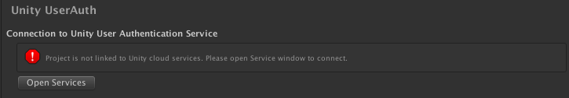

	By default, User Auth Settings provides the following login methods:
	* Anonymous login
	* Email Login
	* Mobile login (verification code login)

	Before use, you need to make the following settings:
	* **create ID Domain**
	* **create OAuth2 Client**

	ID Domain Equivalent to user resource group, such as:
	* All projects share one ID domain (Then users of all projects are jointly managed) 
	* One per project ID domain (Users are independent between projects).

	press **Project Settings ► Player Identity ► Backends ► Unity UserAuth** Enter the settings page

	**ID Domain settings**

	create ID Domain. Selected**Create new ID domain**  

	|  **Field**    |   **Default** | **Notes** |
	| ------------- |-------------|-------------|
	| ID Domain name        | None | Any name is fine (currently unlimited）|

	After clicking the Create button, the newly created ID Domain will appear in the selection box, and the ID of the ID Domain will be displayed in the selection box along with the name.
	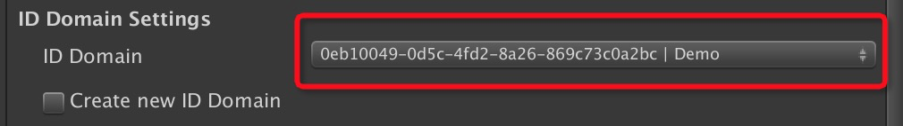


	**OAuth Client settings**
	Create a new OAuth2 Client. The following is the information that needs to be filled in.

	|  **Field**    |   **Default**     | **Notes** |
	| ------------- |-------------|-------------|
	| OAuth Scopes  | openid offline identity.user |These scopes provide the following permissions: <ul><li>openID -  Use third-party login such as WeChat</li><li>offline – Obtain refresh tokens</li><li>identity.user – Link a third-party account</li></ul>|
	| Client Name  | None | Any character is acceptable (currently restricted) |
	| Redirect URIs  | A default value | please do not modify |
	| Additional Scopes  | None | Custom scope, optional |

	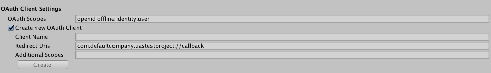

	Click Create to create (if not clickable, you can click the Refresh button).  
	The newly created OAuth Client will appear in the drop-down box. Similarly, the id value will be added before the client name. In authorization APIs (refer to the API documentation), this id value will be used as the parameter "client_id".

	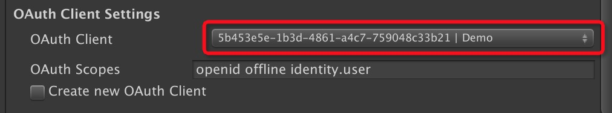

	**ID Provider Settings**
	Specific reference Third-party login-WeChat login 


	**User Auth Other settings**

	|  **Field**    |   **Defaults**     | **描述** | **对用户的影响** |
	| ------------- |-------------|-------------|-------------|
	| API base URL  | `https://identity-api.unity.cn` |Please use the default value, this is the server address |no|
	| Automatically create anonymous user | open |Whether to automatically create an anonymous user for the user | If unchecked, anonymous users will not be created for users who are not logged in。
	| Automatically persist refresh token to enable user auto sign-in  | open | Log in automatically with token |Can realize automatic login|

1. **WeChat login**

	First, you need to register a developer account on the WeChat development platform and obtain the corresponding AppID and AppSecret.
	After obtaining AppID and AppSecret, you can set up WeChat login.
	1. at **Project Settings ► Player Identity ► Backends ► Unity UserAuth**Page for WeChat login settings, check create new ID provider，And select from the drop-down box `wechat.com`

		Fill in the client ID and client Secret.

		|     **Field**   |   **Defaults**     | **description** |
		|-------------|-------------|-------------|
		|     client ID  | None |AppID of WeChat development platform|
		|     client Secret | None |AppSecret of WeChat Development Platform|
		
		Click the "Save" button to save to the server. The client secret is used by the server to obtain the access_token of WeChat. Can refer to[Official WeChat Document](https://developers.weixin.qq.com/doc/oplatform/Website_App/WeChat_Login/Wechat_Login.html)。  

		If developers need to obtain WeChat access token through their own services, they do not need to fill in client secret and client id here. The developer needs to**Project Settings ► Player Identity ► Providers► WeChat**Set the Callback Endpoint. Callback Endpoint is a url, and the SDK will send an http request to this url to obtain the access token. The request sent by the SDK is as follows  
		`GET ${Callback Endpoint}?code={Auth code returned by WeChat}&appid={WeChat appid}`
		
		The json format that developers need to return is as follows：
		```
		{
			"openid": "WeChat openid",
			"access_token": "WeChat access token",
			"errmsg": "wrong information",
			"errcode": 0
		}
		```

	1. at **Project Settings ► Player Identity ► Providers► WeChat** Page for WeChat login settings

		|     **Field**   |   **Defaults**     | **description** |
		|-------------|-------------|-------------|
		|     App ID  | None | AppID of WeChat development platform|
		|     Callback Endpoint | None | If the developer obtains the WeChat access token through his own server, it needs to be filled in. |
		|     Generate Callback code | Check |Whether to use the default WeChat callback method provided by this package, this method user receives[WeChat return value](https://developers.weixin.qq.com/doc/oplatform/Mobile_App/Access_Guide/Android.html)。If you need to implement the callback function yourself, please uncheck it.|

		Note that the app id here and the client id above are a value, but this is used when pulling WeChat, that is, when obtaining the code, it must be filled
	1. Add WeChat login option
		Select one by one **Project Settings ► Player Identity**
		Use the default value in the Select Identity Backend column。

		|     **Field**   |   **Defaults**     | **description** |
		|-------------|-------------|-------------|
		|     Backend Type  | Unity User Auth Loade | Use default options |

		at **Configure Identity Providers** Column, select the platform icon you want to set. Click the "+" icon to add a third-party login method. Select "We Chat Loader". Currently WeChat login supports Android and IOS platforms.


		Fill in identification to complete WeChat login callback:
		* Android fills in according to the information registered on WeChat package name(**player settings->project settings->player->android icon->other settings**)
		* IOS, fill in according to the information registered on WeChat bundle identifier(**player settings->project settings->player->ios icon->other settings**)

1. **other settings**

	at **Project Settings ► Player Identity** Here you can also choose whether to automatically send a verification email to these users who registered with the mailbox:

	|     **Field**   |   **Defaults**     | **description** |
	|-------------|-------------|-------------|
	|     Automatically send verification email to<br> users who sign up with email.  | open |A verification email is automatically sent by default. <br>If the function is enabled, when the user registers with an email address or associates an email address, a verification email will be sent automatically |

1.  **login by phone**
	No other configuration is required for default support.


## Use of Prefab
PlayerId provides Prefab to realize the user interface of user login/registration process, developers can use it directly.

1. Import Prefab
	If you have completed the preceding steps, the Player Identity package has been added to your package dependencies. Next, click on the Project column (located below the Unity editor by default) to open the directory once **Packages  ► Player Identity  ► Prefabs**. Drag UserAuthPrefab into the Hierarchy panel. The editor pops up a TMP (TextMeshPro) installation prompt box, if you have not installed it yet.

2. Set up Prefab (optional)   

	After importing UserAuthPrefab according to the above steps, select (ie click) UserAuthPrefab in the hierarchy, and then you can see some setting options in the inspector column.

	__Player Identity Core (Script)__

	This script is used to process trigger events in the prefab. The following table lists the trigger events that can add additional actions. You can add function callbacks by clicking the "+" button (note that the event is divided into three options: runtime, editing mode and closing). Of course, you can also click "-" to delete function callbacks that are no longer needed.

	note: “List is Empty”（The list is empty) means there is no event processing callback. The following table shows the default actions after the event is triggered.
	
	|     **Event name**   |   **Default actions and modes**     | **Trigger timing** |
	|-------------|-------------|-------------|
	| On Anonymous Login () | Mode: Runtime<br>Action: MainController.OnLogin | Triggered after anonymous login is completed|
	| On Login () | Mode: Runtime<br>Action: MainController.OnLogin | Triggered after login |
	| On Logout () |Mode: Runtime<br>Action: MainController.OnLogout | Triggered after exit |
	| On Access Token Changed () |None (that is, the list is empty) | Triggered when the value of the access token is changed |
	| On Error () | Mode: Runtime<br>Action: MainController.OnError | Triggered when an error occurs |
	| On Link () | Mode: Runtime<br>Action: AccountPanel.OnLinkCompleted | Triggered after linking (link) a third-party account |
	| On Unlink () | Mode: Runtime <br> Action: AccountPanel.OnUnlinkCompleted | Triggered after deleting the third-party account link |
	| On Change Password() | None | Action after password modification |
	| On Reset Password () |None | After resetting the password.|
	| On Create Credential () | None | After an anonymous user adds a mailbox |
	| On Get User () |None | After obtaining user information |
	| On Update User () | None | After finishing updating user information |
	| On Verify Email () | None |After the user completes email verification |


	__Main Controller (Script)__

	This step provides the following options:

	* Panel Controller：Page control script
	* Login Status Controller：Login status script
	* Popup Controller：Popup script
	* Prefab The default script has been given in. If you need to add some functions, you can also use your own function script.

	__Customizer Manager (Script)__  

	The script does not currently provide customization options.

	__Customizer (Script)__

	Provides some options to modify the visual effects of the prefab. For example, the font options can be selected by clicking the round icon on the left of the apply button in the font asset column. Then click the apply button to use (you can view the effect in play mode).

	For more information about customization options, please refer to the appendix.


## run game
Most of the functions provided by PlayerId can be tested in the play mode of the Unity editor. However, the functions related to third-party login and authentication are not supported on the PC side, so they can only be tested on the mobile side (Android or Apple).

1. Unity Editor operation flow

	In the Unity editor, anonymous login, email password login and mobile phone number login can be tested.
	An example of operation is given below：

	Anonymous User

	1. Find the login button and click
	1. Enter the login panel
		1. Click Anonymous Login
	1. After successful login, the account button will appear on the page, click to enter the user account information page
	1. In the account panel, you can perform the following operations on anonymous users
		1. Add mailbox
			1. After a user creates an account with a mailbox, the data of the user under the anonymous account will be linked to the newly created account.
			1. If no other non-anonymous login method is associated, the mailbox cannot be unbound
			1. The verification email will be automatically sent to the bound mailbox (you can also click the verification email to send again)
			1. Click "Email Login"
		1. WeChat login
			1. After linking to a WeChat account, the user's data under the anonymous account will be linked to the WeChat account.
			1. If there is no other non-anonymous login method associated, WeChat cannot be unbound
			1. You can log in to the account with a WeChat account
		1. Exit operation
			1. After the user logs out, he needs to click Anonymous login to use the logged out anonymous account again
			1. The token of the anonymous account is saved, so the information will not be lost

	Email registered users

	1. Click the login button
	1. Enter the login panel
		1. Click on the email to log in
		1. You can click Forgot Password to reset the password
		1. Type in the mailbox password to log in
	1. After successful login, the account button will appear on the page, click to enter the user account information page
	1. In the account panel, you can perform the following operations on anonymous users
		1. If the email has not been verified, the page will display a verify email button, you can click Send Email (only visible to unauthenticated users)
		1. Click the Modify Password button to modify the password
		1. WeChat login
			1. After linking to a WeChat account, the user data will be linked to the WeChat account.
			1. Since there are two login methods at this time, the user can unbind any of them
			1. You can log in through the WeChat login button


1. iOS application compilation
	According to**File ► Build Settings**Enter the settings page
	1. Click Add Open Scenes to add scenes containing prefab to Scenes in Build, as shown below
	1. Switch to iOS platform
	1. at **Project Settings ► Player Identity** Next, select the iOS platform and add the required third-party login provider (such as WeChat login).
	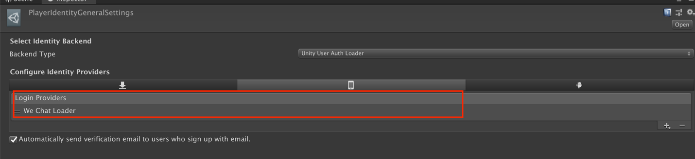
	1. fill in **Project Settings ► Player ►  Settings for iOS** Bundle identifier (required for WeChat login), and other options you need to use. Then click the build button

	Note: macOS Catalina platform only  
	If you are macOS Catalina, you must add OpenGLES3 graphics API。
	1. Click on**Project Settings ► Player**. 
	1. Click Settings for iOS. 
	1. Cancel Auto Graphics API Options. 
	1. at Graphics APIs List:
		* Click+ Button, add OpenGLES3.
		* Click "-" to delete Metal.

1. Android  Application compilation  
    **at build.gradle Add dependency**  
    To compile the Android project, you need to add the following dependencies in **build.gradle**:

	Import **Resources/ExternalDependencyManager.unitypackage**

	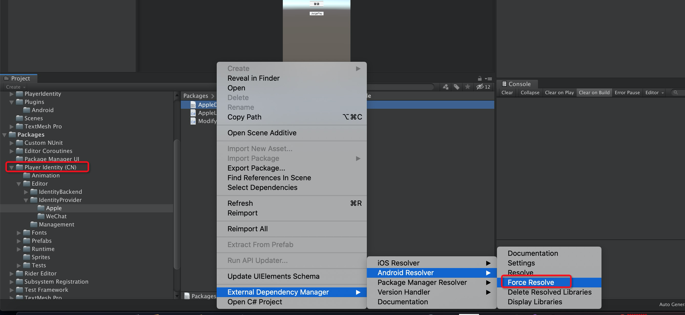


	How to modify the gradle settings in Unity, you can refer to the document [**Unity Gradle for Android**](https://docs.unity3d.com/Manual/android-gradle-overview.html)
     **Providing a custom Gradle build template** section.

	Follow **File ► Build Settings** to enter the setting page
	1. Click Add Open Scenes to add scenes containing prefab to Scenes in Build, as shown below
	1. Switch to Android platform
	1. Under **Project Settings ► Player Identity**, select the Android platform and add the required third-party login provider (such as WeChat login).
	1. Fill in the Package name under Project Settings ► Player ► Android Settings (required for WeChat login), and other options you need to use. Then click the build button

# Appendix

Personalized menu options

| | | | | Features |
|-------------|-------------|-------------|------- ------|-------------|
| Main |General |Font Asset | |Change the font of prefab|
| |General |Size | |Change the size of the prefab main panel|
| |General |Vertical Group Spacing | |Change the vertical spacing between buttons|
|Action Bar |General| Height| | Change the height of the action bar (at the top of the page)|
| | Background Image |Sprite || Action bar background image|
| | Background Image| Color | | The color and transparency of the background image in the action bar |
| |Text |Font Asset||action bar font modification. This will overwrite the font set by general |
| |Text | Font Size||action bar font size|
| |Text |Font Color ||Font color of action bar|
||Close Button|Size||Close Button Size|
||Close Button|Position Offset from Corner ||Close Button|
||Close Button|Image |Sprite|Close Button Image|
||Close Button|Color|Color|Close Button Color|
||Close Button|Hitbox |Size|The effective area of ​​the close button|
||Back Button|Size||Back Button Size|
||Back Button|Position Offset from Corner| |The offset of the back button from the upper left corner|
||Back Button|Image |Sprite|Back Button Image|
||Back Button|Color|Color|Back Button Color|
||Back Button|Hitbox |Size|The effective click area of ​​the back button||
||Separation Line|Height||The height of the dividing line|
||Separation Line|Image|Sprite|Background image of the dividing line|
|Provider Buttons|Size|||Change the size of the login button (such as email login) |
|Primary Action Button |Size |||Change the size of the default button (such as email registration in the account page). |
||Image |Sprite ||Change button background image|
||Image|Active Color||Display color after clicking|
||Image|Inactive Color||Color when not clickable|
||Text |Font Asset||Button font style|
||Text|Font Size||Font Size|
||Text|Active Font Color||The font color after clicking
||Text|Inactive Font Color||Font color when not clickable|Input Field|
|Input Field|Size|||Input Field Size|
||Image|Sprite||Background image of input box|
||Image|Color||The color of the input box|
||Text |Font Asset||Font Style|
||Text|Font Size ||Font Size|
||Text |Font Color||Font Color|
||Placeholder|Font Asset||Prompt text font|
||Placeholder|Font Size ||The size of the prompt text|
||Placeholder|Font Color||The color of the prompt text|
|Footer |Separation Line|Height||The height of the dividing line|
||Separation Line|Image|Sprite|Background image of the dividing line|
||Separation Line|Image|Color|Background color of the separation line|
||Secondary Action Button |Height||The height of the bottom box|
|||Image|Sprite|Bottom frame background image|
||||Color|Bottom frame background color|
|||Text|Font Asset |Font of bottom box|
||||Font Size|Font Size|
||||Font Color|Font Color|
|Background |Sprite|||Background image in the middle of the page|
||Color|||Background color in the middle of the page|
|Popup|General |Fade Time||Fade Time|
||Time Before Hide|||The display time of the pop-up box|
||Vertical Text Margin |||Blank size in the vertical direction of the font|
||Error|Popup Background|Sprite|Background image of error message|
||Popup Background |Color|Background color of error message|
|||Text|Font Asset |Font|
|||Text|Font Size |Font Size|
|||Text|Font Color|Font Color |
||Info|Popup Background|Sprite|Info background image|
|||Popup Background |Color|Background Color|
|||Text|Font Asset |Font|
|||Text|Font Size |Font Size|
|||Text|Font Color|Font Color|

## Extension
You can also use the backend you want.

If you want to choose a customized back-end service, you can implement if the class
* PlayerIdentityBackendSubsystem 
	* Path: `{directory}/com.unity.playerid/Runtime/Backend/PlayerIdentityBackendSubsystem.cs`
* PlayerIdentityBackendSubsystemDescriptor 
	* Path: `{directory}/com.unity.playerid/Runtime/Backend/PlayerIdentityBackendSubsystemDescriptor.cs`

The back-end service (PlayerId) implementation of the service is placed in the following directory for reference   
	`{directory}/com.unity.playerid/Runtime/Backend/UnityUSerAuth/.`

