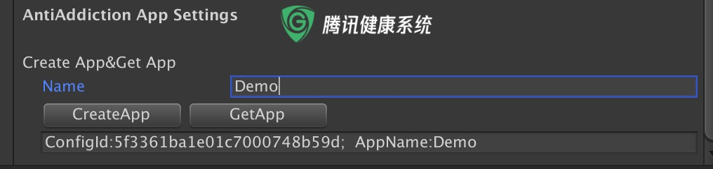
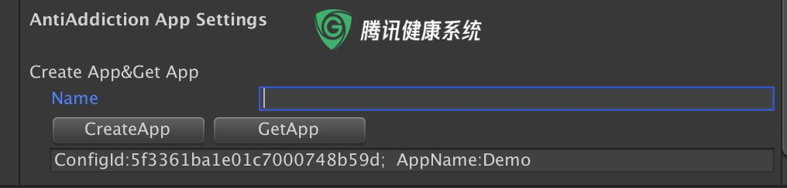
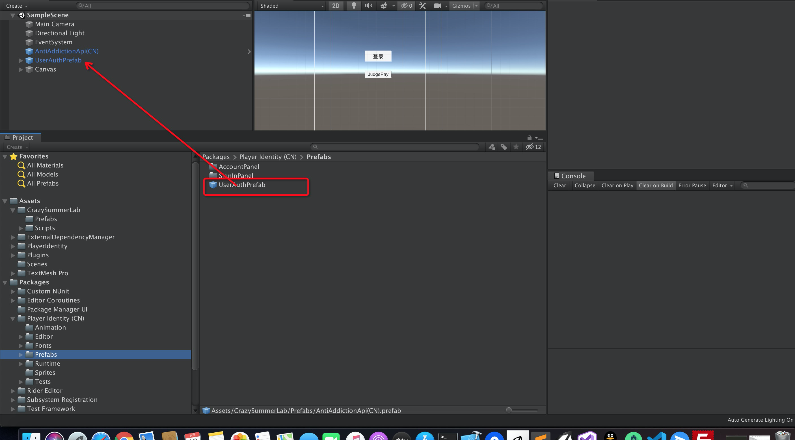
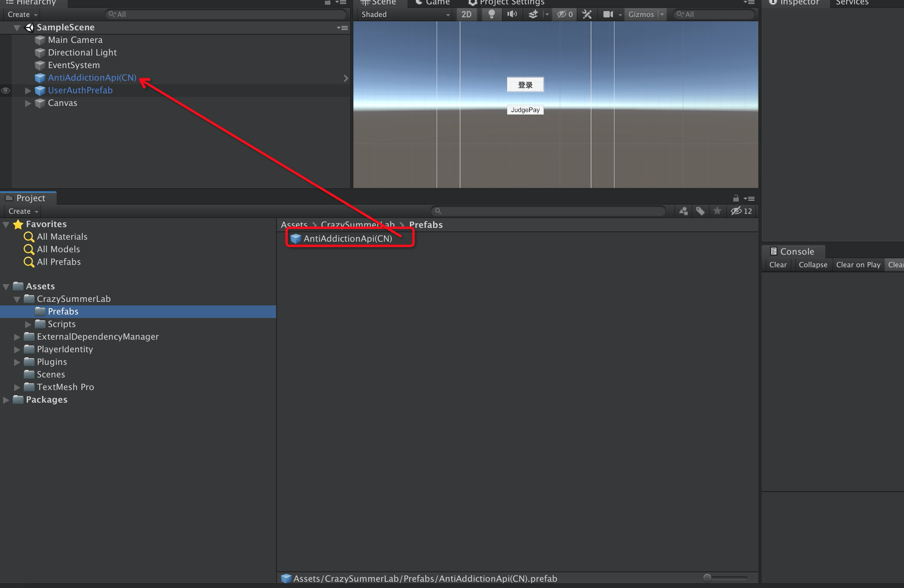
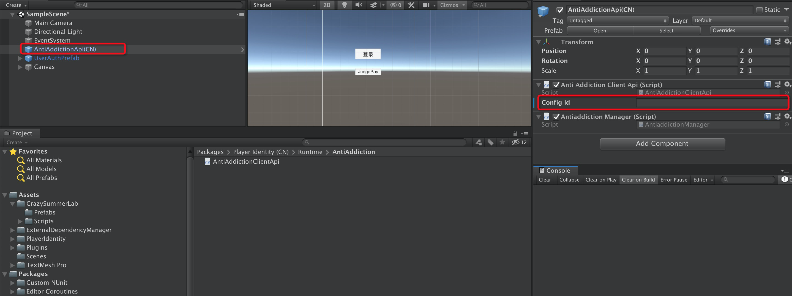
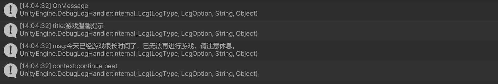
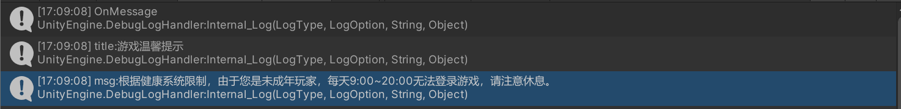
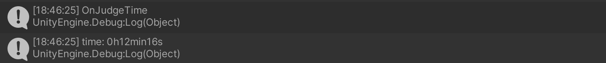
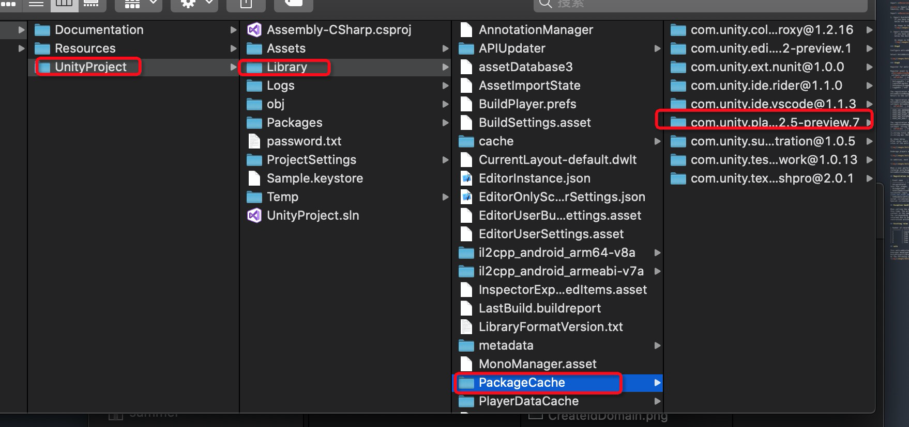

# Anti-addiction system development document

## Summary

### Overview

The anti-addiction system can provide developers with the corresponding functions for anti-addiction. The current anti-addiction system supports the relevant functions of the **login module**, **timing module** and **recharge module**.

**In the login module** (the player user logs in through the Unity PlayerId account. For users without real-name authentication, the browser will automatically open and jump to the real-name authentication interface to guide the user to perform real-name authentication. At this time, the game will be forced offline, and the user needs to log in again. For users who have been authenticated with real names, the anti-addiction system will determine the user's applicable rules based on the authentication information.)

**In the timing module** (the developer is required to register for the specified event to view the player's online play time. (The registration function will be mentioned below) The server will give corresponding instructions or messages according to the user's play market)

**In the recharge module** (the developer needs to register for a specified event to query the age group of the user, and the developer can determine the recharge limit based on this information.)

## Anti-addiction function configuration

### Step1

Download and import and complete the PlayerId SDK configuration, see details PlayerIdentity[Documentation](./Unity玩家账号系统开发文档.md)。

### Step2

Create an anti-addiction app

Open the menu **Edit ► Project Settings**, open **Player Identity ► Backends ► Unity UserAuth**, in the Name column in the AntiAddiction App Settings field, fill in the name of the app you want to create, and click CreateApp to get it below configId, note that configId is uniquely bound to the APP name, which is a necessary attribute for using the anti-addiction function.

Query anti-addiction APP

Open the menu **Edit ► Project Settings**, open **Player Identity ► Backends ► Unity UserAuth**, and click GetApp in the AntiAddiction App Settings field to query the names of all apps created under the current idDomain and the corresponding configId. (Every time the window is opened, all currently created apps will be automatically displayed)

### Step3

Import the specified prefab and start the anti-addiction work

Import **Resources/PlayerIdentity.unitypackage** Into your project

**note:** Import the file automatically generated by Player Identity (CN). If the PlayerIdentity file folder is generated in Assets/ after importing the Player Identity (CN), there is no need to import

Import **Resources/CrazySummerLab.unitypackage** Into your project

1. Import UserAuthPrefab Prefab
    If you have completed the preceding steps, the Player Identity package has been added to your package dependencies. Next, click on the Project column (located below the Unity editor by default) to open the directory once **Packages  ► Player Identity  ► Prefabs**. Drag UserAuthPrefab into the Hierarchy panel.

    As shown in the screenshot below
    

2. Import AntiAddictionApi(CN) prefab
    If you have completed the preceding steps, the Player Identity package has been added to your package dependencies. Next, click on the Project column (located below the Unity editor by default) to open the directory once **Packages  ► Player Identity  ► Prefabs**. Drag AntiAddictionApi(CN) into the Hierarchy panel.

    As shown in the screenshot below
    

### Step4

Configure anti-addiction properties

Select AntiAddictionApi(CN) in the Hierarchy panel, and fill in the ConfigId obtained in Step2 in the AntiAddictionClientApi script in the Inspector panel.

### Step5

Register for anti-addiction events and call anti-addiction API to complete development

Register event to check whether the current user is logged in      
 **AntiaddictionManager.OnLoginStatus += OnLoginStatus;**          
 callback LoginStatus enum description
|  **Field**  | **description** |
|-------------|-------------|-------------|
| NotLoggedIn | user Not logged in |
| LoginInProgress | user login in progress |
| AnonymouslyLoggedIn | user anonymous login |
| LoggedIn | user logged |

The registration event has checked that the current user has entered the game for playing time     
AntiaddictionManager.OnJudgeTimes += OnJudgeTimes      
Return to the current game, always return in seconds(int)

The registration event has checked the current user in which age range    
AntiaddictionManager.OnAntiAddictionUserAge += OnAntiAddictionUserAge;    
callback AntiaddictionType enum description
|  **Field**  | **description** |
|-------------|-------------|-------------|
| USER_AGE_UNKNOWN | user's age is unknown. |
| USER_AGE_ZERO_IN_EiGHT | user's age is in [0,8) |
| USER_AGE_EIGHT_IN_SIXTEEN | user's age is in [8,16) |
| USER_AGE_SIXTEEN_IN_EIGHTEEN | user's age is in [16,18) |
| USER_AGE_ADULT | user's age is in more than 18 |

The registration event has checked whether the current user’s underage triggers an anti-addiction strategy     
AntiaddictionManager.OnMandatoryOffline += OnMandatoryOffline;    
callback  string,string
|  **Field**  | **description** |
|-------------|-------------|-------------|
|1.string title |Back to the title of Anti-Addiction Strategy|
|1.string mes |Return to the description of the anti-addiction strategy|

As shown below      
After minor users play for more than a certain period of time on the same day, the server will trigger a prompt or force an offline instruction according to the rules of the anti-addiction system.

Underage players will also be forced offline if they have reached the upper limit of play time on the day or log in during the curfew period.

In addition, each call to the API also returns the playing time of the current user.

When a user performs a recharge operation, by calling the recharge module API, the developer can obtain the age range of the user and set the upper limit of recharge according to the age range.You can manually query the age (the function below)     
AntiaddictionManager.Instance.JudgePay(result =>{Debug.Log("SampleSceen JudgePay: " + result.ToString());});

## Registration issue

| Event name    | Incoming parameters               | Event description                               |
| ----------- | ---------------------- | ------------------------------------------------------------ |
| OnLoginStatus   | <LoginStatus> | Pass in an enumerated type parameter, which represents whether the user is successfully logged in. The login status is divided into four stages. [NotLoggedIn]user Not logged in,[LoginInProgress]user login in progress,[AnonymouslyLoggedIn]user anonymous login,[LoggedIn] ,user logged|
| OnJudgeTimes   | <Int32>        | PPass in a parameter of type int, which represents the playing time of the current user, in seconds |
| OnAntiAddictionUserAge  | <AntiaddictionType> | PPass in an enumerated type parameter, and change the enumeration to record the age group you are in after a successful login. It is divided into five segments [USER_AGE_UNKNOWN]user's age is unknown,[USER_AGE_ZERO_IN_EiGHT]user's age is in [0,8), [USER_AGE_EIGHT_IN_SIXTEEN]user's age is in [8,16),[USER_AGE_SIXTEEN_IN_EIGHTEEN],user's age is in [16,18),[USER_AGE_ADULT]user's age is in more than 18|
| OnMandatoryOffline | <String,String>  | Pass in two string type parameters, and use this event to get the message returned by the anti-addiction system. Under normal circumstances, title and message will return to the anti-addiction copywriting, which can be displayed to the player by the developer through the UI. Special circumstances and exception handling will also be passed in through this event, see the exception handling section|

## Exception handling

When calling the anti-addiction system API, there is an error message returned due to incorrect upload data format, poor network conditions or server problems. At this time, the error message will be passed in through the OnMessage event, the title is AntiAddictionServerError, msg is the specific error message, and the context is the same as above. . For the case of the upload data format error, msg will point out the target with the wrong format, and the developer needs to solve the corresponding error during the development phase to ensure that the data format error will not occur during the actual use of the player. For error messages returned due to poor network conditions or server problems, the anti-addiction system defaults the current user as an adult player, and will not take any restrictive actions, and developers can ignore it.

## Existing rules of anti-addiction system

| Number of records | Rule type | Rule name                           | Client   |
| :------- | -------- | ---------------------------------- | ---------- |
| 1        | Login authentication | Verified                           | Unauthenticated user |
| 2        | time limit | Night curfew under 18 years old (22:00-8:00 the next day) | All users  |
| 3        | time limit | Under the age of 18, 1.5 hours on weekdays are prohibited to play          | All users    |
| 4        | time limit | 3 hours ban on holidays under 18 years old            | All users    |
| 5        | time limit | 1 hour reminder on working days for under 18            | All users    |
| 6        | time limit | 2 hours reminder for holidays under 18            | All users    |

## note

This anti-addiction unity plug-in can only be downloaded in China in unity package manager.
Overseas developers need to decompress com.unity.playerid-cn@0.2.5-preview.7 under Resources/Files, and after decompression, they need to put them under UnityProject/Library/PackageCache     
As the following screenshot    
